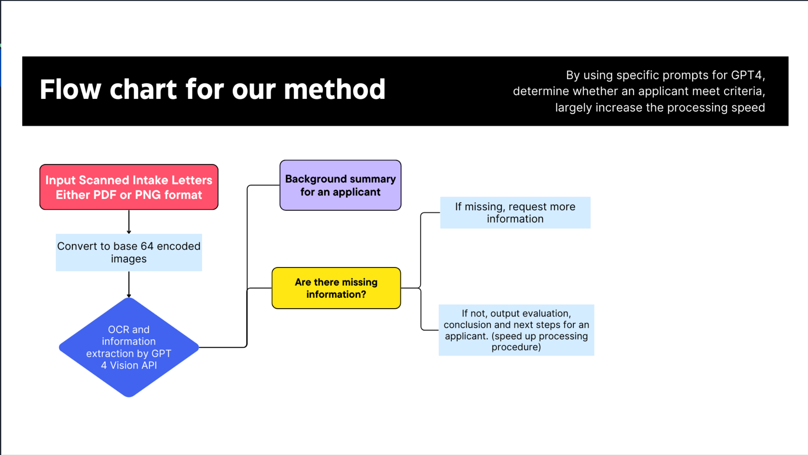
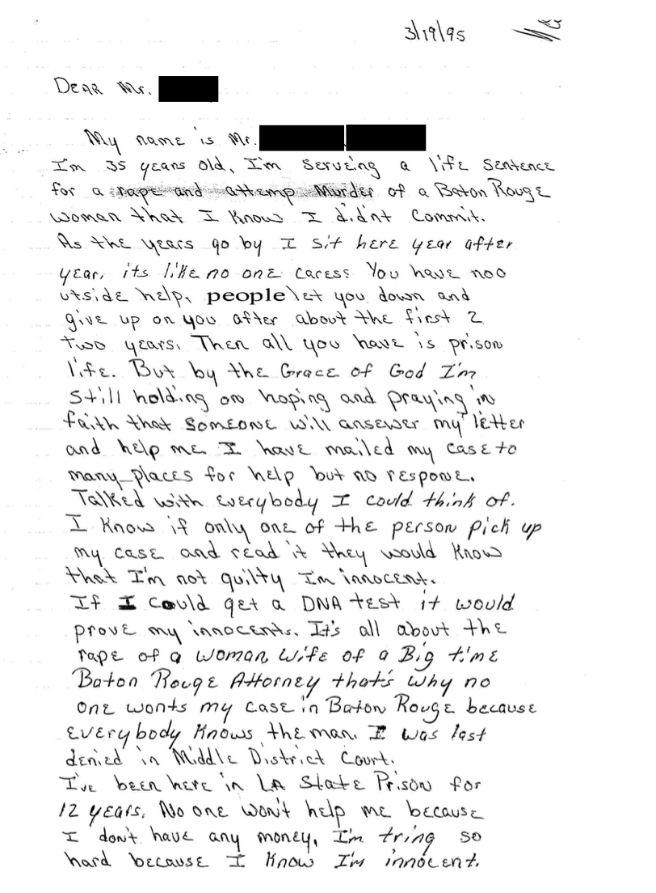

# Project Documentation: Enhancing Case Processing for the Innocence Project with LangChain and GPT

---

## Introduction

The [Innocence Project](https://innocenceproject.org/) faces a significant challenge in processing a high volume of cases, each requiring thorough review to determine alignment with specific criteria for wrongful convictions. The current manual method is time-consuming and prone to delays. Our project aims to introduce a transformative solution by leveraging the capabilities of LangChain and GPT to automate and expedite this process.

---

## Background

In its mission to exonerate the wrongly convicted through DNA testing and reform the criminal justice system to prevent future injustices, the Innocence Project deals with numerous case applications. These applications undergo a meticulous review process to assess their eligibility based on set criteria. The primary challenges in this process include:

- **Speed Improvement Needed:** To handle cases more efficiently and reduce waiting times for applicants.
- **Action on Incomplete Submissions:** Managing incomplete applications by requesting additional information.
- **Criteria-Based Decision Making:**
  - **Mismatch:** Rejecting cases that do not meet the criteria.
  - **Match:** Forwarding eligible cases to specialized teams for further action.

---

## Challenges

- **Limited Literacy and Language Diversity:** The wide range of educational backgrounds and languages in submissions adds complexity to understanding and assessing cases.
- **Compromised Submission Quality:** Frequent issues with legibility due to poor submission materials.
- **Spelling and Grammar Variability:** Errors often obscure important details of cases.
- **Ethical Considerations:** Ensuring the ethical use of automation while protecting privacy and addressing potential biases.

---

## Solution

To address these challenges, our project proposes the following solution tailored for the Innocence Project:

- **Enhanced Accuracy/Efficiency:** By automating the intake letter and application processing using GPT, we aim to significantly improve the accuracy and speed of the review process.
- **Criteria-Based Filtering:** The system automatically assesses each case against the Innocence Project's criteria, efficiently sorting cases into categories for further action.
- **Advanced Character and Language Recognition:** Utilizing GPT's advanced capabilities to recognize and interpret challenging characters and languages, ensuring no case is overlooked due to readability issues.
- **Support for Human Evaluators:** Despite automation, the system is designed to assist human evaluators by providing preliminary summaries and assessments, with final decisions made by legal professionals.
- **Privacy Protection:** Sensitive information is redacted before processing to protect privacy, using anonymization techniques before submission to the OpenAI API.

---

## Pipeline Overview

Here, a visual representation of the pipeline would be included, illustrating the automated workflow from case submission to decision.

We also have a [demo notebook](notebooks/innocence_project.ipynb) that showcases the pipeline in action, demonstrating the automated processing of a sample case submission.

## Examples

### Case Submission 
Here, a sample case submission would be included.

### Automated Processing Results
- **Background**: The applicant, Mr. [Name Redacted], is currently serving a life sentence for attempted murder in Baton Rouge. He claims innocence, expressing that he knows he did not commit the crime. Despite this conviction, he has been actively seeking help and has reached out to many places but has not received any response. He believes that if his case were read by someone, they would know he is not guilty. Mr. [Name Redacted] is seeking to obtain a DNA test to prove his innocence. He alludes to the case involving the rape of a woman who is the wife of a prominent Baton Rouge attorney and suggests that this connection may be a reason no one in Baton Rouge will take his case, hinting at a potential conflict of interest or bias due to the victim's husband's status. Throughout the 12 years he has spent in prison, he feels as though he has been let down by people and that no one cares after the first two years, leaving him with nothing but his faith and hope for assistance. His current financial situation is mentioned as a barrier to getting help, as he has no money. He emphasizes his efforts and desire for help based on his proclaimed innocence.
- **Evaluation**: 1. The case does not involve consent/transaction issues as the applicant maintains his innocence and denies committing the crime. 2. The case does not fall under self-defense/justification criteria as the applicant asserts that he did not commit the crime and is seeking a review of his case. 3. There is no indication of sustained abuse in this case. 4. The case does not involve illegal substance charges. 5. The case does not relate to RICO/Hobbs Act charges. 6. The case does not pertain to DWI/DUI charges. 7. The case does not involve fraud/identity theft/forgery. 8. There is no evidence of stalking/harassment in this case. 9. The case does not center around sentencing reduction/overcharge issues.
- **Conclusion**: The case does not match any of the excluded criteria and is suitable for further review.
- **Next Steps**: The case is forwarded to the review team for detailed evaluation.

---

## Special Features

- **Anonymization:** Prioritizing privacy by anonymizing identification before processing.
- **Local LLM Usage:** Utilizing local language models to enhance privacy protection.
- **Fine-tuning Visual Question Answering:** To extract information from intake letters without relying on external APIs.
- **Prompt Engineering:** Developing more refined prompts to improve the efficiency and accuracy of automated processing.

---

## Future Works

To further enhance the project's capabilities and address the evolving needs of the Innocence Project, we plan to:

- **Finetune a Visual Question Answering Model:** This will allow for the extraction of critical information from intake letters more accurately and without the need for external APIs, ensuring higher levels of privacy and security.
- **Use Local LLMs:** Implementing local language models will enhance privacy protection by processing sensitive data in-house rather than relying on external services.
- **Expand Prompt Engineering:** Developing more sophisticated prompts will improve the system's ability to understand and categorize cases more effectively, leading to faster and more accurate processing.

---

## Conclusion

By integrating LangChain and GPT into the case processing workflow, the Innocence Project can significantly enhance its efficiency and effectiveness in fighting wrongful convictions. This solution not only accelerates the review process but also ensures that each case is evaluated with the utmost accuracy and care, bringing us closer to a just and equitable legal system.
